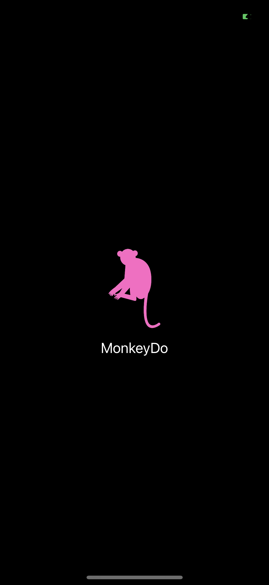
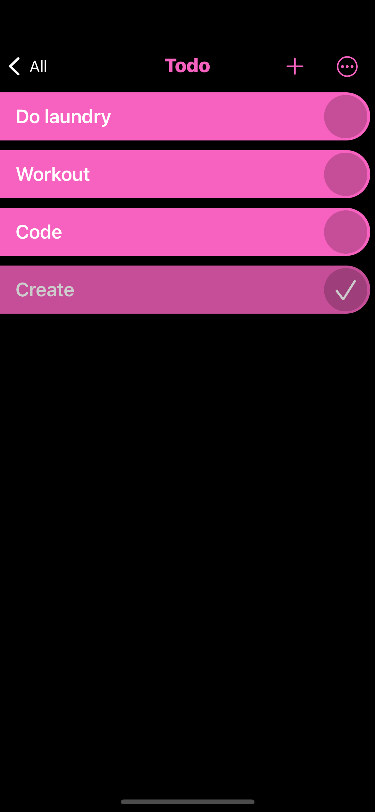

# MonkeyDo
Todo-List App using CoreData

* Create lists for example todo-list, shopping-list, wish-list...
* Add items to your list
* Check and uncheck items
* Delete items
* Change the order of your items
* Checked items automatically move to the bottom of the your list
* Setting to automatically hide or remove checked items
* Randomly assigns one of 5 colors to your list

 

&nbsp;&nbsp;&nbsp;
&nbsp;&nbsp;&nbsp;

